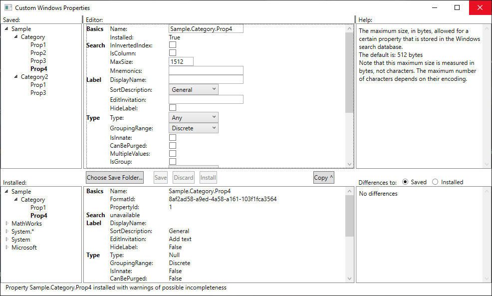

# Custom Windows Properties

A stand-alone application for creating, installing and uninstalling custom Windows properties.

It looks like this:

What it does:
- Keep a catalog of custom properties, which are presented in the tree in the top left of the screen.
- When a custom property is selected, show all of its properties in the panel on the top right, and allow them to be edited and saved.
- Create a new by entering its new name and saving it.
- Delete a custom property from the catalog by selecting it and then clicking on the Delete button.
- Shows all of the properties installed on the system, including pre-installed and custom properties, presenting them in the tree in the bottom left of the screen.
- When an installed property is selected, show all of its properties that are made available by the system in the panel on the bottom right.
- If an installed property has characteristics that you want in your custom property, use the Copy button to copy them to the editing area.
- When you are ready, select a custom property and click the Install button. If the installation succeeds, your property will now appear in the installed properties tree at the bottom left.
- To remove a custom property from the system, selected in the installed property tree, and then press the Uninstall button.

Versions:   
0.1 - First working version, for testing functionality and usability

## Work list
- Write the readme!
- Go through properties and see which can be sourced from the system, but are not at the moment, and those which could not be but are not marked as unavailable.
- See if the registry will point out system property descriptions that we can parse for some of the missing information
- Add the help text for the properties, from a localised resource
- Source all messages from localised resources
- Look to see if any more display properties should be added
- Document this subtlety for canonical name: if A.B.C exists, then A.B is not an acceptable name for a new terminal
- Document how names work independently, no such thing as folder renaming
- If two properties are added, with names differing only in the last part, then they should have the same format ID, but different property IDs
- Detect when the edited property is dirty, so that we can warn about changes being lost as appropriate
- React to changes in canonical name without having to move away from the field
- Consider remembering tree selections and restoring them or bringing them into view after the tree is updated, where required
- Document the separate permanent universally available location for the propdesc files that we install. The system loads from them lazily, possibly using the identity of whoever is signed on, or the system, in the case of the index server.
- Read back installed property configurations so that they are available for immediate inspection without restarting the program
- Document current best understanding of what incomplete installation might mean

Example markup:
**Latest:** Version 1.6 is now the recommended [release](../../releases/tag/v1.6).  [documentation](../../wiki) has been updated 
