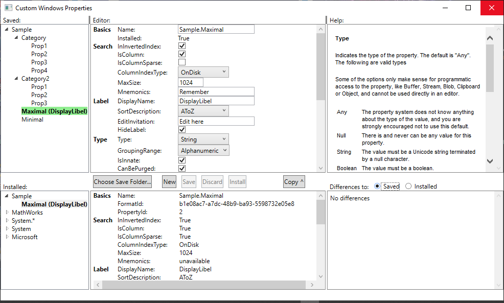

# Custom Windows Properties

A stand-alone application for creating, installing and uninstalling custom Windows properties.

It looks like this:

What it does:
- Keep a catalog of custom properties, which are presented in the tree in the top left of the screen. This catalog is kept in a data folder. The very first thing you will need to do on opening the app for the first time is to use the 'Choose Save Folder...' button to say what folder the app should use.
- When a custom property is selected, show all of its properties in the top middle panel, and allow them to be edited and saved.
- When an individual field is being edited, help text about that field is shown in the top right panel.
- A summary of the changes that you have made appear in the differences panel in the bottom right of the screen.
- If at any point you want to discard the changes that you have made, press the Discard button.
- Create a new custom property by entering its new name and saving it.
- Once you have saved a property, it will appear in the tree at the top left panel.
- Selecting any property in the saved tree will load it into the editor. Any changes you make to the saved values will be shown in the differences panel, as before.
- You can only delete a property that has been saved. To do so, select it in the saved tree, right click on it to show the context menu, and choose Delete.
- The installed tree in the bottom left panel shows all of the properties installed on the system, including pre-installed and custom properties.
- When an installed property is selected, show all of its properties that are made available by the system in the bottom middle panel.
- If an installed property has characteristics that you want in your custom property, use the Copy button to copy them to the editing area.
- When you are ready to install a custom property that you have created, there are two options. If the property has been saved, selected in the saved tree, then use the Install command in its context menu. Alternatively, if the property is currently loaded in the editor, click the Install button. This will save the property and then install it. If the installation succeeds, your property will now appear in the installed properties tree at the bottom left. The property will also be read back from the system, and the values obtained shown in the middle bottom panel. Installed properties are also shown with a green background in the saved tree.
- To uninstall a custom property from the system, select it in the installed property tree, and then use the Uninstall command in its context menu. You can only uninstall a property which also appears in the saved tree, which basically means properties that you yourself have created. Accordingly, you cannot delete a property which has been installed: you must uninstall it first.
- By default, the differences made by changes in the editor will be shown the relative to whatever set of properties were last loaded into it (for instance, when a property is selected in the saved tree, or the copy button is used to load the editor from an installed property). You can use the radio buttons above the differences panel to show the differences to the most recently seen saved or installed property instead.
- If you want to use your custom properties as part of an installation package, in the custom property tree, select either an individual property, or the immediate parent of a set of properties, and use the Export command in its context menu. This will create a .propdesc file in the data folder containing the single property, or the set of child properties of the chosen parent.

## Usage Notes
- In the Microsoft documentation about creating custom properties, the recommendation is to think hard about what you need before you start, and not to chop and change too much. One good reason for this is that for searchable properties, which will be most useful ones, the Index Server builds indexes, and gets confused if things changes too much. The warning is that you may finishing up needing to rebuild the index.
- The best way to think about custom properties is that each one is a separate idea, with its own unique name and identity. Custom properties may share parts of their name, for example Sample.Location.AreaCode and Sample.Location.Rating. But this is of no great significance to the operating system. 
- Multilevel property names help you to think about and find them. A good way to think about is by analogy with files and folders. They have similar restrictions. So, for example, once you have created a property called Sample.City, you cannot create another one called Sample.City.Population. Equally, if you have created a property called Sample.City.Population, you cannot create another one called Sample.City, but you could create a property called Sample.Country, or one called Sample.City.Area.
- One difference to files and folders, however, is that you cannot rename a property. You can clone it and create one with a new name, or you can delete it, and that is all. And you certainly cannot rename the equivalent of a 'folder'.
- There is an important distinction between what you see in the editor and the saved tree, and what you see in the installed panels. The installed panels show only data that has been read from the operating system. The editor and the saved tree show the configuration that you hope will be achieved should you install it.
- It is not actually possible to obtain from the operating system values for all of the property attributes that you can configure. Installed property information shown in the panel at the middle bottom of the screen mark such attributes as 'unavailable'.
- The main focus of the tool is on attributes that can be round-tripped, i.e. those that can be configured in an installation and then read back to confirm their values. The tool covers nearly 100% of such attributes (an example of a holdout is RelativeDifferenceType, which is mostly only relevant when writing programs which use the property system).
- Some attributes can be configured that cannot be read back if they are of particular significance, such as the EditControl, and the display formatting attributes. However, coverage is less complete in these areas, perhaps at 75%. Requests for enhancements will be considered!
- When you first the tool, about the first thing that you need to do is to specify the Saved Data folder. This is where the tool keeps all of the saved properties, and if you copy the contents of this directory from machine to machine, the saved properties will appear in the tool on the target machine, if you configure the copied folder as the Saved Data folder on the target machine.
- However, installed property configurations need to be held in a separate area, partly to ensure that they are accessible to all users of the machine, and partly because Windows may load data from them lazily at any time, and so they had better not move about after installation. The folder used is <System drive>:\ProgramData\CustomWindowsProperties. It is strongly recommended that you leave the contents of this folder alone. It is not useful to copy this folder from machine to machine: instead, copy the Saved Data folder and install the properties on the new machine.

## Versions:   
0.4 - First complete version, for testing as a candidate for the initial release

## Work list
- Source all messages from localised resources
- Document technical detail of what parts of the schema are not covered
- Document technical detail on current best understanding of what incomplete installation might mean
